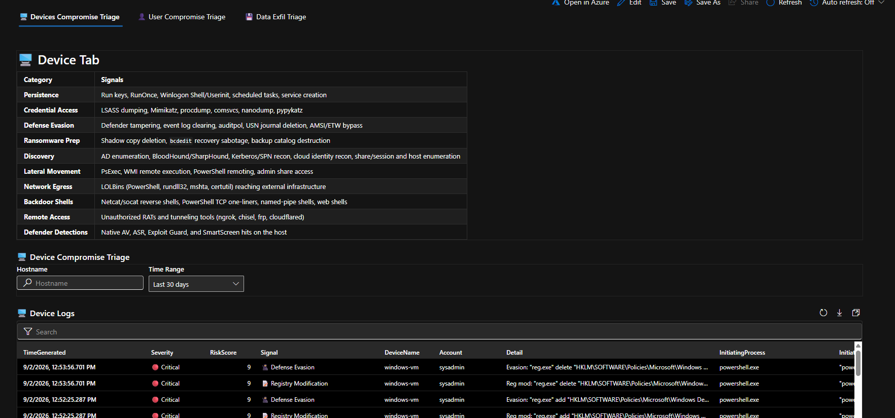

# 🛡️ Device Compromise Triage

**On-demand post-compromise investigation for a single endpoint.**

Parameterized Microsoft Sentinel / Defender XDR queries for post-compromise investigation, risk-scored and severity-ranked.

Traditionally, working a suspect device or account means opening a dozen separate queries across process, registry, network, identity, and mailbox telemetry — then lining up timestamps by hand, and eyeballing which hits actually matter. During an active incident, that setup work is the bottleneck, not the analysis.

These consolidate it into a single parameterized view. Pick an entity, pick a time range, get a chronological timeline in seconds — sorted by risk, not just time, so the most dangerous activity surfaces first.

---

## 🎯 Why this exists

Investigating a suspect endpoint normally means running a dozen separate hunts — process, registry, network, and file telemetry — then correlating the results by hand and manually deciding what's worth chasing first. During an active incident that setup work is the bottleneck, not the analysis. This collapses ten detection categories into one parameterized, risk-ranked view.

Use it when a device surfaces in an alert, appears on the endpoint dashboard, or is named by a user under investigation.

---

## ⚖️ Risk Score

Every event gets a `RiskScore` (0–10) and a Severity label — 🔴 Critical / 🟠 High / 🟡 Medium / ⚪ Low — based on how dangerous the technique is, with a boost for high-confidence recon and hard signals. Results sort worst-first by default, so the top of the table is always what needs attention first.

---

## 🔍 What it searches for

| Category | Signals |
| --- | --- |
| **Persistence** | Run keys, RunOnce, Winlogon Shell/Userinit, scheduled tasks, service creation |
| **Credential Access** | LSASS dumping, Mimikatz, procdump, comsvcs, nanodump, pypykatz |
| **Defense Evasion** | Defender tampering, event log clearing, auditpol, USN journal deletion, AMSI/ETW bypass |
| **Ransomware Prep** | Shadow copy deletion, `bcdedit` recovery sabotage, backup catalog destruction |
| **Discovery** | AD enumeration, BloodHound/SharpHound, Kerberos/SPN recon, cloud identity recon, share/session and host enumeration |
| **Lateral Movement** | PsExec, WMI remote execution, PowerShell remoting, admin share access |
| **Network Egress** | LOLBins (PowerShell, rundll32, mshta, certutil) reaching external infrastructure |
| **Backdoor Shells** | Netcat/socat reverse shells, PowerShell TCP one-liners, named-pipe shells, web shells |
| **Remote Access** | Unauthorized RATs and tunneling tools (ngrok, chisel, frp, cloudflared) |
| **Defender Detections** | Native AV, ASR, Exploit Guard, and SmartScreen hits on the host |

## 📊 Visualization of the Dashboard


---
## KQL
```kql
// ============================================================
// DEVICE COMPROMISE TRIAGE v4.0 - Workbook (Parameterized, Risk-Scored)
// ============================================================
// MITRE ATT&CK:
//   T1059         - Execution: malicious PowerShell
//   T1547 / T1543 - Persistence: autostart keys, scheduled tasks, services
//   T1136 / T1098 / T1078 - Persistence/PrivEsc: account manipulation
//   T1112         - Defense Evasion: registry modification
//   T1562 / T1070 - Defense Evasion: impair defenses, indicator removal
//   T1003.001     - Credential Access: LSASS memory
//   T1087 / T1069 / T1482 / T1558 - Discovery and Kerberos recon
//   T1021         - Lateral Movement: remote services
//   T1071 / T1572 - C2: web protocols, tunneling
//   T1219         - C2: remote access software
//   T1490         - Impact: inhibit system recovery
//
// v4.0 CHANGES:
//   - Added RiskScore (0-10) + Severity bucket per event
//   - Discovery/Recon sub-category (🔴/🟠/🟡 embedded in Detail) now
//     feeds directly into scoring instead of being cosmetic only
//   - Hard-signal events get a scoring boost on top of their base weight
//   - Default sort is now RiskScore desc, then TimeGenerated desc
let TargetDevice = "{DeviceName}";
let BenignParents = dynamic([
    "msedge.exe", "msedgewebview2.exe",
    "MicrosoftEdgeUpdate.exe", "IntuneManagementExtension.exe",
    "backgroundTaskHost.exe"
]);
let HardSignalKeywords = dynamic([
    "Credential Access", "Ransomware Prep", "Backdoor", "Defense Evasion",
    "Account Manipulation", "Registry Modification", "Malicious PowerShell"
]);
union isfuzzy=true
// ============================================================
// TA0002 EXECUTION -- T1059 malicious PowerShell (download/encode/hidden)
// ============================================================
(
    DeviceProcessEvents
    | where TimeGenerated {TimeRange}
    | where isempty(TargetDevice) or DeviceName has TargetDevice
    | where FileName in~ ("powershell.exe", "pwsh.exe")
    | where ProcessCommandLine has_any (
        "DownloadFile", "DownloadString", "DownloadData",
        "Invoke-Expression", "IEX", "iex(",
        "EncodedCommand", "-enc ", "-ec ",
        "FromBase64String",
        "Net.WebClient", "WebRequest", "Start-BitsTransfer",
        "Invoke-WebRequest", "curl ", "wget ")
        or (ProcessCommandLine has "-WindowStyle Hidden"
            and ProcessCommandLine has "-ExecutionPolicy Bypass")
        or (ProcessCommandLine has "-NonInteractive"
            and ProcessCommandLine has "-NoProfile"
            and ProcessCommandLine has_any ("http", "ftp", "\\\\"))
    | project TimeGenerated, Signal = "⚡ Malicious PowerShell", DeviceName,
              Account = AccountName,
              InitiatingProcess = InitiatingProcessFileName,
              InitiatingProcessCmd = InitiatingProcessCommandLine,
              ChildProcess = FileName,
              SHA256,
              Detail = strcat("PS: ", substring(ProcessCommandLine, 0, 250))
),
// ============================================================
// TA0003 PERSISTENCE -- T1547 autostart keys (registry-state source)
// ============================================================
(
    DeviceRegistryEvents
    | where TimeGenerated {TimeRange}
    | where isempty(TargetDevice) or DeviceName has TargetDevice
    | where ActionType in ("RegistryValueSet", "RegistryKeyCreated")
    | where RegistryKey has_any (
        "CurrentVersion\\Run", "CurrentVersion\\RunOnce",
        "Winlogon\\Shell", "Winlogon\\Userinit", "Policies\\Explorer\\Run",
        "CurrentVersion\\RunServices", "CurrentVersion\\RunServicesOnce",
        "BootExecute", "AppInit_DLLs", "Image File Execution Options")
    | project TimeGenerated, Signal = "🔧 Registry Persistence", DeviceName,
              Account = InitiatingProcessAccountName,
              InitiatingProcess = InitiatingProcessFileName,
              InitiatingProcessCmd = InitiatingProcessCommandLine,
              ChildProcess = "",
              SHA256 = InitiatingProcessSHA256,
              Detail = strcat("Reg: ", RegistryValueName, " = ",
                             substring(RegistryValueData, 0, 200))
),
// ============================================================
// TA0003 PERSISTENCE -- T1053.005 / T1543 scheduled tasks & services
// ============================================================
(
    DeviceProcessEvents
    | where TimeGenerated {TimeRange}
    | where isempty(TargetDevice) or DeviceName has TargetDevice
    | where ProcessCommandLine has_any (
        "schtasks /create", "/sc onlogon", "/sc onstart",
        "/sc onstartup", "/ru system",
        "New-ScheduledTask", "Register-ScheduledTask",
        "sc create", "New-Service")
    | project TimeGenerated, Signal = "🔧 Task/Service Persistence", DeviceName,
              Account = AccountName,
              InitiatingProcess = InitiatingProcessFileName,
              InitiatingProcessCmd = InitiatingProcessCommandLine,
              ChildProcess = FileName,
              SHA256,
              Detail = strcat("Task/Svc: ", substring(ProcessCommandLine, 0, 250))
),
// ============================================================
// TA0003/TA0004 PERSISTENCE/PRIVESC -- T1098 account manipulation
// ============================================================
(
    DeviceProcessEvents
    | where TimeGenerated {TimeRange}
    | where isempty(TargetDevice) or DeviceName has TargetDevice
    | where (ProcessCommandLine has "localgroup" and
             ProcessCommandLine has_any ("/add", "/delete"))
        or (ProcessCommandLine has "net user" and
            ProcessCommandLine has_any ("/add", "/delete"))
        or ProcessCommandLine has "/active:yes"
        or ProcessCommandLine has "/active:no"
        or ProcessCommandLine has_any (
            "New-LocalUser", "Add-LocalGroupMember",
            "Set-LocalUser", "Enable-LocalUser", "Disable-LocalUser",
            "Remove-LocalGroupMember",
            "net localgroup administrators",
            "net localgroup \"remote desktop users\"")
    | project TimeGenerated, Signal = "👤 Account Manipulation", DeviceName,
              Account = AccountName,
              InitiatingProcess = InitiatingProcessFileName,
              InitiatingProcessCmd = InitiatingProcessCommandLine,
              ChildProcess = FileName,
              SHA256,
              Detail = strcat("Account: ", substring(ProcessCommandLine, 0, 250))
),
// ============================================================
// TA0005 DEFENSE EVASION -- T1112 persistence/RDP/AV registry mods (reg.exe)
// ============================================================
(
    DeviceProcessEvents
    | where TimeGenerated {TimeRange}
    | where isempty(TargetDevice) or DeviceName has TargetDevice
    | where FileName in~ ("reg.exe", "regedit.exe")
        and ProcessCommandLine has_any ("add", "delete", "import")
        and ProcessCommandLine has_any (
            "CurrentVersion\\Run", "CurrentVersion\\RunOnce",
            "Terminal Server", "fDenyTSConnections", "AllowTSConnections",
            "DisableAntiSpyware", "DisableAntiVirus",
            "Winlogon", "AppInit_DLLs", "Image File Execution Options",
            "SecurityProviders", "Lsa", "DisabledComponents")
    | project TimeGenerated, Signal = "📝 Registry Modification", DeviceName,
              Account = AccountName,
              InitiatingProcess = InitiatingProcessFileName,
              InitiatingProcessCmd = InitiatingProcessCommandLine,
              ChildProcess = FileName,
              SHA256,
              Detail = strcat("Reg mod: ", substring(ProcessCommandLine, 0, 250))
),
// ============================================================
// TA0005 DEFENSE EVASION -- T1562/T1070 impair defenses, clear logs, AMSI
// ============================================================
(
    DeviceProcessEvents
    | where TimeGenerated {TimeRange}
    | where isempty(TargetDevice) or DeviceName has TargetDevice
    | where ProcessCommandLine has_any (
        "DisableRealtimeMonitoring", "DisableBehaviorMonitoring",
        "Set-MpPreference", "Add-MpPreference -ExclusionPath",
        "DisableAntiSpyware", "DisableAntiVirus",
        "wevtutil cl", "Clear-EventLog", "auditpol /clear",
        "fsutil usn deletejournal", "TamperProtection",
        "AmsiScanBuffer", "amsiInitFailed",
        "Remove-MpPreference", "Set-MpPreference -Disable")
    | project TimeGenerated, Signal = "🥷 Defense Evasion", DeviceName,
              Account = AccountName,
              InitiatingProcess = InitiatingProcessFileName,
              InitiatingProcessCmd = InitiatingProcessCommandLine,
              ChildProcess = FileName,
              SHA256,
              Detail = strcat("Evasion: ", substring(ProcessCommandLine, 0, 250))
),
// ============================================================
// TA0006 CREDENTIAL ACCESS -- T1003.001 LSASS dumping / cred tooling
// ============================================================
(
    DeviceProcessEvents
    | where TimeGenerated {TimeRange}
    | where isempty(TargetDevice) or DeviceName has TargetDevice
    | where ProcessCommandLine has_any (
        "Mimikatz", "sekurlsa", "logonpasswords", "lsadump",
        "procdump", "comsvcs.dll", "MiniDumpWriteDump", "nanodump",
        "lsass.dmp", "Out-Minidump", "pypykatz", "lsassy",
        "Invoke-Mimikatz", "DumpCreds")
        or (ProcessCommandLine has "comsvcs" and ProcessCommandLine has "lsass")
        or (ProcessCommandLine has "\\lsass")
        or (FileName =~ "procdump.exe" and ProcessCommandLine has "lsass")
    | project TimeGenerated, Signal = "🔑 Credential Access", DeviceName,
              Account = AccountName,
              InitiatingProcess = InitiatingProcessFileName,
              InitiatingProcessCmd = InitiatingProcessCommandLine,
              ChildProcess = FileName,
              SHA256,
              Detail = strcat("Cred: ", substring(ProcessCommandLine, 0, 250))
),
// ============================================================
// TA0007 DISCOVERY -- T1087/T1069/T1558/T1082/T1016/T1018 recon
// ============================================================
(
    DeviceProcessEvents
    | where TimeGenerated {TimeRange}
    | where isempty(TargetDevice) or DeviceName has TargetDevice
    | extend ReconCategory = case(
        ProcessCommandLine has_any (
            "net group \"domain admins\"", "net group \"enterprise admins\"",
            "net group \"domain controllers\"", "net localgroup administrators",
            "net accounts /domain", "dsquery", "dsget", "adfind",
            "Get-ADUser", "Get-ADGroup", "Get-ADComputer", "Get-ADDomain",
            "Get-DomainUser", "Get-NetUser", "Get-NetGroup",
            "Get-DomainController", "Get-NetDomainController"),
            "🔴 AD Enumeration",
        ProcessCommandLine has_any (
            "SharpHound", "Invoke-BloodHound", "-CollectionMethod",
            "bloodhound", "azurehound", "Get-DomainTrust", "Get-ForestTrust"),
            "🔴 BloodHound/AD Mapping",
        ProcessCommandLine has_any (
            "setspn -q", "setspn -l", "Get-DomainSPNTicket",
            "Invoke-Kerberoast", "GetUserSPNs", "Rubeus kerberoast"),
            "🔴 Kerberos/SPN Recon",
        ProcessCommandLine has_any (
            "az account", "az ad", "aws sts get-caller-identity",
            "aws iam", "gcloud auth", "Get-AzureADUser", "Get-MgUser",
            "Connect-AzAccount", "Get-AzRoleAssignment",
            "kubectl get secrets"),
            "🔴 Cloud/Identity Recon",
        ProcessCommandLine has_any (
            "net view", "net share", "net session", "net use",
            "Get-NetShare", "Get-NetSession", "Find-DomainShare",
            "PsLoggedon", "quser", "qwinsta", "query session"),
            "🟠 Share/Session Discovery",
        ProcessCommandLine has_any (
            "net user", "net localgroup", "whoami /priv", "whoami /groups",
            "whoami /all", "Get-LocalUser", "Get-LocalGroupMember",
            "cmdkey /list", "wmic useraccount"),
            "🟠 Local Account/Priv Enum",
        (ProcessCommandLine has_any (
            "Get-MpComputerStatus", "Get-MpPreference", "sc query windefend",
            "tasklist /svc", "fltmc", "driverquery")
            and ProcessCommandLine has_any (
                "defender", "crowdstrike", "sentinel",
                "cylance", "sophos", "mcafee", "falcon")),
            "🟠 Security Product Discovery",
        ProcessCommandLine has_any (
            "ipconfig", "arp -a", "arp /a", "route print", "netstat",
            "nltest /dclist", "nltest /domain_trusts", "nbtstat",
            "Resolve-DnsName", "ping -n"),
            "🟡 Network Discovery",
        ProcessCommandLine has_any (
            "systeminfo", "hostname", "wmic os", "wmic computersystem",
            "Get-ComputerInfo", "Get-WmiObject Win32_",
            "reg query", "wmic qfe", "wmic product"),
            "🟡 Host/System Enum",
        FileName in~ (
            "whoami.exe", "net.exe", "net1.exe", "nltest.exe",
            "systeminfo.exe", "ipconfig.exe", "arp.exe", "route.exe",
            "quser.exe", "tasklist.exe", "netstat.exe", "wmic.exe",
            "dsquery.exe"),
            "🟡 Recon Binary",
        ""
    )
    | where isnotempty(ReconCategory)
    | project TimeGenerated, Signal = "🔍 Discovery/Recon", DeviceName,
              Account = AccountName,
              InitiatingProcess = InitiatingProcessFileName,
              InitiatingProcessCmd = InitiatingProcessCommandLine,
              ChildProcess = FileName,
              SHA256,
              Detail = strcat(ReconCategory, ": ", FileName, " ",
                             substring(ProcessCommandLine, 0, 200))
),
// ============================================================
// TA0008 LATERAL MOVEMENT -- T1021 remote exec, PsExec, WMI, WinRM
// ============================================================
(
    DeviceProcessEvents
    | where TimeGenerated {TimeRange}
    | where isempty(TargetDevice) or DeviceName has TargetDevice
    | where FileName in~ ("psexec.exe", "psexesvc.exe", "paexec.exe")
        or ProcessCommandLine has_any (
            "Invoke-Command", "Enter-PSSession", "New-PSSession",
            "wmic /node", "\\admin$", "\\c$",
            "Invoke-WMIMethod", "Invoke-SMBExec",
            "winrs -r", "winrs.exe")
    | project TimeGenerated, Signal = "↔️ Lateral Movement", DeviceName,
              Account = AccountName,
              InitiatingProcess = InitiatingProcessFileName,
              InitiatingProcessCmd = InitiatingProcessCommandLine,
              ChildProcess = FileName,
              SHA256,
              Detail = strcat("Lateral: ", FileName, " ",
                             substring(ProcessCommandLine, 0, 200))
),
// ============================================================
// TA0011 COMMAND & CONTROL -- T1059/T1071 backdoor / reverse shell
// ============================================================
(
    DeviceProcessEvents
    | where TimeGenerated {TimeRange}
    | where isempty(TargetDevice) or DeviceName has TargetDevice
    | where ProcessCommandLine has_any (
            "nc.exe -e", "ncat", "-e cmd", "-e /bin/sh", "-e powershell",
            "socat", "/bin/bash -i", "bash -i", "sh -i",
            "Invoke-PowerShellTcp", "Nishang", "powercat",
            "Invoke-Shellcode", "Invoke-ReverseShell")
        or (ProcessCommandLine has "System.Net.Sockets.TCPClient"
            and ProcessCommandLine has_any ("GetStream", "sendback", "iex"))
        or (ProcessCommandLine has "\\\\.\\pipe\\"
            and ProcessCommandLine has_any ("cmd", "powershell"))
        or (ProcessCommandLine has_any ("python", "python3")
            and ProcessCommandLine has_any (
                "socket.socket", "SOCK_STREAM", "pty.spawn"))
        or (InitiatingProcessFileName in~ (
                "w3wp.exe", "httpd.exe", "nginx.exe",
                "tomcat.exe", "php-cgi.exe")
            and FileName in~ ("cmd.exe", "powershell.exe", "pwsh.exe"))
    | project TimeGenerated, Signal = "🐚 Backdoor / Reverse Shell", DeviceName,
              Account = AccountName,
              InitiatingProcess = InitiatingProcessFileName,
              InitiatingProcessCmd = InitiatingProcessCommandLine,
              ChildProcess = FileName,
              SHA256,
              Detail = strcat("Shell: ", FileName, " ",
                             substring(ProcessCommandLine, 0, 250))
),
// ============================================================
// TA0011 COMMAND & CONTROL -- T1071.001 LOLBin network egress
// ============================================================
(
    DeviceNetworkEvents
    | where TimeGenerated {TimeRange}
    | where isempty(TargetDevice) or DeviceName has TargetDevice
    | where InitiatingProcessFileName in~ (
        "powershell.exe", "pwsh.exe", "cmd.exe",
        "rundll32.exe", "regsvr32.exe", "mshta.exe",
        "wscript.exe", "cscript.exe", "certutil.exe")
    | where RemoteIPType == "Public"
    | where not(InitiatingProcessCommandLine contains "OpenRead"
        and InitiatingProcessCommandLine contains "CanRead")
    | where not(tolower(RemoteUrl) has_any (
        "google.com", "gstatic.com", "msftconnecttest.com",
        "msftncsi.com", "microsoft.com", "windowsupdate.com",
        "azure.com", "azureedge.net"))
    | project TimeGenerated, Signal = "🌐 LOLBin Network Egress", DeviceName,
              Account = InitiatingProcessAccountName,
              InitiatingProcess = InitiatingProcessFileName,
              InitiatingProcessCmd = InitiatingProcessCommandLine,
              ChildProcess = "",
              SHA256 = InitiatingProcessSHA256,
              Detail = strcat("Egress: ", InitiatingProcessFileName, " -> ",
                             coalesce(RemoteUrl, RemoteIP), ":", RemotePort)
),
// ============================================================
// TA0011 COMMAND & CONTROL -- T1219/T1572 remote tools & tunnels
// ============================================================
(
    DeviceProcessEvents
    | where TimeGenerated {TimeRange}
    | where isempty(TargetDevice) or DeviceName has TargetDevice
    | where FileName in~ (
        "AnyDesk.exe", "RustDesk.exe", "QuickAssist.exe", "AeroAdmin.exe",
        "Supremo.exe", "ammyy.exe", "aa_v3.exe", "GetScreen.exe",
        "ScreenConnect.Client.exe", "ConnectWiseControl.Client.exe",
        "SplashtopSOS.exe", "LogMeIn.exe", "GoToAssist.exe",
        "ZohoAssist.exe", "RemotePC.exe", "meshagent.exe", "dwagent.exe",
        "RemoteUtilities.exe", "rutserv.exe", "Radmin.exe",
        "winvnc.exe", "tvnserver.exe", "uvnc_service.exe", "vncviewer.exe",
        "ngrok.exe", "frpc.exe", "chisel.exe", "cloudflared.exe", "plink.exe")
    | where FileName !in~ (
        "TeamViewer.exe", "TeamViewer_Service.exe", "tv_w32.exe",
        "tv_x64.exe", "BeyondTrust.exe", "bomgar-scc.exe", "raserver.exe")
    | extend IsTunneler = FileName in~ (
        "ngrok.exe", "frpc.exe", "chisel.exe", "cloudflared.exe", "plink.exe")
    | project TimeGenerated,
              Signal = iff(IsTunneler, "🕳️ Tunneling Tool",
                                       "🖥️ Unauthorized Remote Tool"),
              DeviceName, Account = AccountName,
              InitiatingProcess = InitiatingProcessFileName,
              InitiatingProcessCmd = InitiatingProcessCommandLine,
              ChildProcess = FileName,
              SHA256,
              Detail = strcat(iff(IsTunneler, "Tunnel: ", "RAT: "),
                             FileName, " ", substring(ProcessCommandLine, 0, 200))
),
// ============================================================
// TA0040 IMPACT -- T1490 ransomware prep / recovery sabotage
// ============================================================
(
    DeviceProcessEvents
    | where TimeGenerated {TimeRange}
    | where isempty(TargetDevice) or DeviceName has TargetDevice
    | where ProcessCommandLine has_any (
        "vssadmin delete shadows", "wmic shadowcopy delete",
        "Win32_ShadowCopy", "bcdedit /set recoveryenabled no",
        "bcdedit /set safeboot", "wbadmin delete catalog",
        "vssadmin resize shadowstorage", "diskshadow",
        "del /s /f /q", "cipher /w")
    | project TimeGenerated, Signal = "💥 Ransomware Prep", DeviceName,
              Account = AccountName,
              InitiatingProcess = InitiatingProcessFileName,
              InitiatingProcessCmd = InitiatingProcessCommandLine,
              ChildProcess = FileName,
              SHA256,
              Detail = strcat("Recovery sabotage: ",
                             substring(ProcessCommandLine, 0, 250))
),
// ============================================================
// CROSS-CUTTING -- native Defender detections on this host
// ============================================================
(
    DeviceEvents
    | where TimeGenerated {TimeRange}
    | where isempty(TargetDevice) or DeviceName has TargetDevice
    | where ActionType has_any (
        "AntivirusDetection", "AntivirusReport",
        "SecurityLogCleared", "AsrLsassCredentialTheftBlocked",
        "ExploitGuardNetworkProtectionBlocked", "SmartScreenUrlWarning",
        "TamperingAttempt", "AntivirusDetectionNotBlocked")
    | project TimeGenerated, Signal = "🛡️ Defender Detection", DeviceName,
              Account = InitiatingProcessAccountName,
              InitiatingProcess = InitiatingProcessFileName,
              InitiatingProcessCmd = InitiatingProcessCommandLine,
              ChildProcess = FileName,
              SHA256,
              Detail = strcat(ActionType, " | ",
                             substring(tostring(AdditionalFields), 0, 200))
),
// --- Schema pin keeps union column order and types stable ---
(
    datatable(TimeGenerated:datetime, Signal:string, DeviceName:string,
              Account:string, InitiatingProcess:string,
              InitiatingProcessCmd:string, ChildProcess:string,
              SHA256:string, Detail:string)[]
)
// ============================================================
// NOISE SUPPRESSION - hard signals bypass this entirely
// ============================================================
| extend IsHardSignal = Signal has_any (HardSignalKeywords)
| extend IsBenignParent =
    InitiatingProcess in~ (BenignParents)
    or InitiatingProcessCmd contains
        "\\Microsoft Intune Management Extension\\Content\\DetectionScripts\\"
    or (InitiatingProcessCmd contains "-ExecutionPolicy AllSigned"
        and InitiatingProcessCmd contains "SessionState.LanguageMode")
    or InitiatingProcessCmd contains "--msedgewebview"
    or InitiatingProcessCmd contains "hpatchmonTask"
    or InitiatingProcessCmd contains "RunCommandExtension"
    or (InitiatingProcess =~ "svchost.exe"
        and (InitiatingProcessCmd contains "-s DPS"
             or InitiatingProcessCmd contains "-s SysMain"
             or InitiatingProcessCmd contains "-s DiagTrack"))
| where IsHardSignal or not(IsBenignParent)
// ============================================================
// RISK SCORING - base weight per signal type + situational modifiers
// ============================================================
| extend BaseScore = case(
    Signal has "Credential Access", 9,
    Signal has "Ransomware Prep", 9,
    Signal has "Backdoor", 9,
    Signal has "Defense Evasion", 7,
    Signal has "Registry Modification", 7,
    Signal has "Lateral Movement", 7,
    Signal has "Tunneling Tool", 7,
    Signal has "Registry Persistence", 6,
    Signal has "Task/Service Persistence", 6,
    Signal has "Account Manipulation", 6,
    Signal has "Malicious PowerShell", 6,
    Signal has "LOLBin Network Egress", 6,
    Signal has "Defender Detection", 6,
    Signal has "Unauthorized Remote Tool", 5,
    Signal has "Discovery/Recon", 4,
    3
)
| extend DiscoveryBoost = case(
    Signal has "Discovery/Recon" and Detail has "🔴", 3,
    Signal has "Discovery/Recon" and Detail has "🟠", 2,
    0
)
| extend RiskScore = min_of(BaseScore + DiscoveryBoost + iff(IsHardSignal, 2, 0), 10)
| extend Severity = case(RiskScore >= 9, "🔴 Critical",
                         RiskScore >= 7, "🟠 High",
                         RiskScore >= 5, "🟡 Medium", "⚪ Low")
| extend InitiatingProcessCmd = substring(InitiatingProcessCmd, 0, 120)
| extend Detail = substring(Detail, 0, 150)
| project TimeGenerated, Severity, RiskScore, Signal, DeviceName, Account, Detail,
          InitiatingProcess, InitiatingProcessCmd, ChildProcess, SHA256
| sort by RiskScore desc, TimeGenerated desc
```
